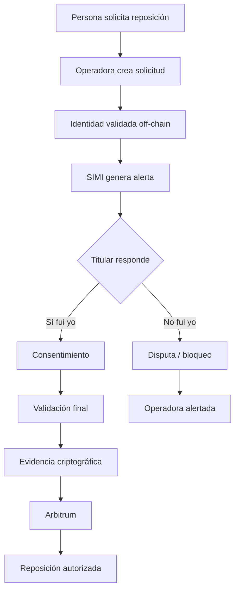
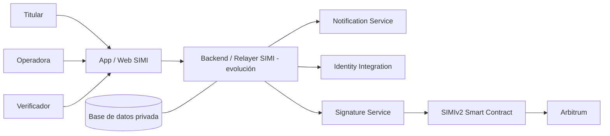

# SIMI V2

SIMI es una infraestructura de seguridad B2B2C para operadoras de telecomunicaciones. Añade consentimiento explícito del titular y evidencia verificable a procesos críticos de reposición SIM sin reemplazar los sistemas internos de la operadora.

> **Objetivo:** que una reposición sensible no dependa únicamente de un registro interno o de la decisión unilateral de un operador.

## Problema

Un atacante puede intentar obtener una SIM de reemplazo mediante ingeniería social, datos filtrados, documentos falsificados, credenciales comprometidas o abuso interno. Si toma control del número, puede intentar interceptar SMS, OTP y flujos de recuperación de cuentas.

SIMI fortalece específicamente el **proceso de autorización de reposición SIM**. No elimina phishing, malware, corrupción interna, robo de identidad ni fraude financiero.

## Público objetivo

- **Cliente principal:** operadoras de telecomunicaciones.
- **Usuario protegido:** titular de la línea.
- **Modelo:** B2B2C.

La experiencia del titular evita conceptos de blockchain. MetaMask, gas, RPC, hashes y contratos son detalles técnicos del MVP, no elementos centrales del producto final.

## Flujo



## Arquitectura



**Los datos privados no entran a blockchain.** DNI, teléfono completo, biometría, documentos, correos y datos de agencia permanecen off-chain.

## Qué se registra on-chain

Únicamente evidencia crítica como:

- `requestId` pseudónimo;
- `subscriberHash`;
- `proofHash`;
- autorización o disputa;
- timestamps críticos;
- versión de política;
- eventos del contrato.

## SIMI V1 vs SIMI V2

La arquitectura original conceptual utilizaba operaciones on-chain independientes para creación, validación y consentimiento.

SIMI V2 propone:

1. Operadora firma el sobre de solicitud off-chain.
2. Verificador firma la evidencia de identidad off-chain.
3. Titular firma consentimiento off-chain.
4. El contrato verifica las tres evidencias mediante EIP-712.
5. Una transacción final registra la autorización.
6. La **disputa permanece como vía de emergencia independiente** cuando sea necesario bloquear inmediatamente.

La prioridad no es presumir una sola transacción, sino reducir operaciones innecesarias sin sacrificar seguridad.

## Smart Contract V2

Archivo: `contracts/SIMIv2.sol`

Usa:

- EIP-712 Typed Structured Data;
- OpenZeppelin `EIP712`, `ECDSA` y `AccessControl`;
- roles de operadora y verificador;
- expiración;
- evidencia de solicitud, verificación y consentimiento;
- protección contra replay mediante `usedEvidence`;
- estado final único por solicitud;
- ruta separada de disputa.

### Protecciones contempladas

- operador no autorizado → reject;
- verificador no autorizado → reject;
- titular incorrecto → reject;
- payload modificado → firmas inválidas / payload mismatch;
- expiración → reject;
- replay → reject;
- doble autorización → reject;
- solicitud disputada → no puede autorizarse después;
- evidencia vinculada al dominio EIP-712 del contrato y la red.

> El contrato aún debe compilarse, probarse y desplegarse antes de declararlo listo para producción. El repositorio inicial no contenía toolchain ni tests blockchain ejecutables.

## UX por roles

### Operadora

Dashboard con:

- solicitudes activas;
- pendientes;
- esperando titular;
- autorizadas;
- disputadas;
- tabla de solicitudes;
- línea enmascarada;
- timeline;
- alerta enviada;
- detalle técnico de auditoría;
- indicador de alto riesgo para disputas.

### Verificador

Flujo reducido a validaciones pendientes y acción de `Registrar identidad verificada`.

### Titular

Diseño mobile-first con dos decisiones principales:

- **Sí, fui yo**
- **No reconozco esta solicitud**

La UX evita términos como gas, nonce, RPC o `execution reverted`.

## Alertas

El frontend actual demuestra el flujo de alerta de manera **simulada y explícitamente marcada**. No se afirma una integración real con WhatsApp/SMS todavía.

Arquitectura objetivo:

- `sendWhatsApp()`
- `sendSMS()`
- `sendPush()`
- `sendEmail()`

La URL de una alerta solo debe abrir la solicitud; nunca debe bastar para autorizarla.

## Privacidad

Una base de datos tradicional sigue siendo necesaria para operar SIMI y almacenar información privada. Blockchain **no reemplaza** esa base de datos. Se utiliza como capa independiente de integridad para eventos críticos.

## Threat Model resumido

SIMI considera:

- empleado malicioso;
- verificador comprometido;
- credenciales robadas;
- replay attacks;
- firmas reutilizadas;
- frontend comprometido;
- SIM swapping;
- ingeniería social;
- usuario que no responde;
- disputa del titular.

### Trust assumptions

- El sistema de identidad externo sigue siendo responsable de realizar la validación real.
- SIMI comprueba quién firma una evidencia; no puede demostrar por sí solo que una biometría externa fue ejecutada correctamente.
- La operadora administra qué cuentas tienen rol autorizado; en producción estos cambios deberían protegerse con multisig/timelock.
- El titular debe contar con un mecanismo criptográfico seguro; una implementación productiva debería abstraer wallets tradicionales con passkeys, embedded wallets o smart accounts.

## Arbitrum

Red objetivo del MVP:

- Network: Arbitrum Sepolia
- Chain ID: `421614`
- Explorer: `https://sepolia.arbiscan.io`

Arbitrum se utiliza como L2 EVM para ejecutar el contrato y mantener evidencia verificable con una experiencia compatible con tooling Ethereum.

## Frontend

Ubicación:

```text
frontend/
├── index.html
├── package.json
├── vercel.json
├── .env.example
├── public/assets/simi/
└── src/
    ├── App.jsx
    ├── main.jsx
    └── styles.css
```

### Ejecutar localmente

```bash
cd SIMI-main/frontend
npm install
npm run dev
```

### Build

```bash
npm run build
```

## Variables de entorno

Copia `.env.example` a `.env.local` para desarrollo.

```env
VITE_CHAIN_ID=421614
VITE_CHAIN_NAME=Arbitrum Sepolia
VITE_CONTRACT_ADDRESS=
VITE_EXPLORER_URL=https://sepolia.arbiscan.io
VITE_USE_SIMI_V2=true
VITE_DEMO_MODE=true
VITE_NOTIFICATION_PROVIDER=simulated
```

**Nunca colocar private keys, seed phrases o secretos de backend en variables `VITE_*`, porque son públicas en el bundle del navegador.**

## Deploy en Vercel

Al importar `SAEZ1205/SIMI-ETHEREUM`:

1. Branch: `main`.
2. Root Directory: `SIMI-main/frontend`.
3. Framework Preset: Vite (si Vercel lo autodetecta) u Other con el `vercel.json` incluido.
4. Build Command: `npm run build`.
5. Output Directory: `dist`.
6. Deploy.

Para la UI actual no es necesario añadir variables privadas en Vercel.

## Demo actual

El frontend está preparado para enseñar dos narrativas:

### Escenario A — legítimo

Operadora crea solicitud demo → Verificador registra identidad → Titular selecciona `Sí, fui yo` → interfaz muestra autorización y evidencia demo.

### Escenario B — fraude

Operadora crea solicitud → identidad validada → Titular selecciona `No reconozco esta solicitud` → solicitud pasa a `DISPUTED` → dashboard muestra `ALTO RIESGO`.

## Qué es real hoy y qué es demo

### Implementado en el frontend

- UI Operadora;
- UI Verificador;
- UI Titular;
- estados centralizados;
- timeline;
- responsive/mobile-first;
- mock data ficticio;
- flujo autorizado;
- flujo disputado;
- alertas simuladas claramente etiquetadas;
- detalle de auditoría conceptual;
- assets de SIMI reutilizados.

### Preparado pero pendiente de integración real

- conexión de wallet abstraída;
- firma EIP-712 desde frontend/backend;
- relayer;
- despliegue de `SIMIv2.sol`;
- ABI y dirección reales;
- WhatsApp/SMS reales;
- tests de contrato;
- benchmark de gas V1 vs V2;
- backend de producción.

## Costos

No se muestran cifras inventadas. Para comparar V1 y V2 de forma responsable faltan:

1. disponer del contrato V1 real;
2. compilar V1/V2 con el mismo toolchain;
3. ejecutar los mismos escenarios;
4. medir `gasUsed`;
5. calcular:

```text
reductionPercentage = ((V1Gas - V2Gas) / V1Gas) * 100
```

Después pueden proyectarse 1, 1,000, 100,000 y 1,000,000 solicitudes usando supuestos de gas explícitos y actualizables.

## Limitaciones del MVP

- Las wallets tradicionales representan actores durante la demo.
- Las alertas actuales son simuladas.
- El verificador es manual.
- No existe todavía backend/relayer productivo.
- `SIMIv2.sol` aún no tiene suite de tests ejecutada dentro de este repositorio.
- La UI de demo mantiene estado en memoria y se reinicia al recargar.

## Roadmap

- conectar wallet y typed signatures EIP-712;
- desplegar SIMIv2 en Arbitrum Sepolia;
- añadir ABI + blockchain service;
- añadir relayer y gas sponsorship;
- embedded wallet/passkeys;
- integración real con proveedor de notificaciones;
- tests de seguridad y benchmark;
- multisig/timelock para administración sensible;
- integración con sistemas de identidad de operadoras.

---

**SIMI utiliza blockchain únicamente donde aporta integridad y trazabilidad; la operadora conserva sus sistemas normales y el titular recibe una experiencia sencilla de seguridad.**
